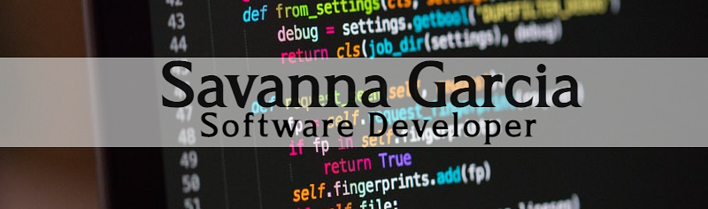

  

<h2> I'm a mother, wife and a student at CodeUp</h2>

- 🔭 Attending CodeUp in San Antonio TX
- 🌱 I’m currently learning Java!
- ⚙️ I use daily: `.js`, `.html`, `.css`
- 💎 2021 Goals: Transition into a developer career
- 🔥 Fun fact: I am a huge LOTR fan
 

### Languages and Tools:

  

  
:zap: GitHub Stats

  

  
:zap: Top Languages

  

